# Projects and dependencies analysis

This document provides a comprehensive overview of the projects and their dependencies in the context of upgrading to .NETCoreApp,Version=v10.0.

## Table of Contents

- [Executive Summary](#executive-Summary)
  - [Highlevel Metrics](#highlevel-metrics)
  - [Projects Compatibility](#projects-compatibility)
  - [Package Compatibility](#package-compatibility)
  - [API Compatibility](#api-compatibility)
  - [Binding Redirect Configuration](#binding-redirect-configuration)
- [Aggregate NuGet packages details](#aggregate-nuget-packages-details)
- [Top API Migration Challenges](#top-api-migration-challenges)
  - [Technologies and Features](#technologies-and-features)
  - [Most Frequent API Issues](#most-frequent-api-issues)
- [Projects Relationship Graph](#projects-relationship-graph)
- [Project Details](#project-details)

  - [DesignPatterns.AbstractFactory\DesignPatterns.AbstractFactory.csproj](#designpatternsabstractfactorydesignpatternsabstractfactorycsproj)
  - [DesignPatterns.AdapterPattern\DesignPatterns.AdapterPattern.csproj](#designpatternsadapterpatterndesignpatternsadapterpatterncsproj)
  - [DesignPatterns.BridgePattern\DesignPatterns.BridgePattern.csproj](#designpatternsbridgepatterndesignpatternsbridgepatterncsproj)
  - [DesignPatterns.BuilderPattern\DesignPatterns.BuilderPattern.csproj](#designpatternsbuilderpatterndesignpatternsbuilderpatterncsproj)
  - [DesignPatterns.ChainOfResponsibilityPattern\DesignPatterns.ChainOfResponsibilityPattern.csproj](#designpatternschainofresponsibilitypatterndesignpatternschainofresponsibilitypatterncsproj)
  - [DesignPatterns.CommandPattern\DesignPatterns.CommandPattern.csproj](#designpatternscommandpatterndesignpatternscommandpatterncsproj)
  - [DesignPatterns.CompositePattern\DesignPatterns.CompositePattern.csproj](#designpatternscompositepatterndesignpatternscompositepatterncsproj)
  - [DesignPatterns.DecoratorPattern\DesignPatterns.DecoratorPattern.csproj](#designpatternsdecoratorpatterndesignpatternsdecoratorpatterncsproj)
  - [DesignPatterns.FacadePattern\DesignPatterns.FacadePattern.csproj](#designpatternsfacadepatterndesignpatternsfacadepatterncsproj)
  - [DesignPatterns.FlyWeightPattern\DesignPatterns.FlyWeightPattern.csproj](#designpatternsflyweightpatterndesignpatternsflyweightpatterncsproj)
  - [DesignPatterns.IteratorPattern\DesignPatterns.IteratorPattern.csproj](#designpatternsiteratorpatterndesignpatternsiteratorpatterncsproj)
  - [DesignPatterns.MediatorPattern\DesignPatterns.MediatorPattern.csproj](#designpatternsmediatorpatterndesignpatternsmediatorpatterncsproj)
  - [DesignPatterns.MementoPattern\DesignPatterns.MementoPattern.csproj](#designpatternsmementopatterndesignpatternsmementopatterncsproj)
  - [DesignPatterns.ObserverPattern\DesignPatterns.ObserverPattern.csproj](#designpatternsobserverpatterndesignpatternsobserverpatterncsproj)
  - [DesignPatterns.ProxyPattern\DesignPatterns.ProxyPattern.csproj](#designpatternsproxypatterndesignpatternsproxypatterncsproj)
  - [DesignPatterns.Singleton\DesignPatterns.Singleton.csproj](#designpatternssingletondesignpatternssingletoncsproj)
  - [DesignPatterns.StatePattern\DesignPatterns.StatePattern.csproj](#designpatternsstatepatterndesignpatternsstatepatterncsproj)
  - [DesignPatterns.StrategyPattern\DesignPatterns.StrategyPattern.csproj](#designpatternsstrategypatterndesignpatternsstrategypatterncsproj)
  - [DesignPatterns.TemplateMethodPattern\DesignPatterns.TemplateMethodPattern.csproj](#designpatternstemplatemethodpatterndesignpatternstemplatemethodpatterncsproj)
  - [DesignPatterns.VisitorPattern\DesignPatterns.VisitorPattern.csproj](#designpatternsvisitorpatterndesignpatternsvisitorpatterncsproj)
  - [DRY.Library\DRY.Library.csproj](#drylibrarydrylibrarycsproj)
  - [DRY.TestProject\DRY.TestProject.csproj](#drytestprojectdrytestprojectcsproj)
  - [DRY.WinForms\DRY.WinForms.csproj](#drywinformsdrywinformscsproj)
  - [FactoryMethod\DesignPatterns.FactoryMethod.csproj](#factorymethoddesignpatternsfactorymethodcsproj)
  - [SOLID.DependencyInversion\SOLID.DependencyInversion.csproj](#soliddependencyinversionsoliddependencyinversioncsproj)
  - [SOLID.InterfaceSegregation\SOLID.InterfaceSegregation.csproj](#solidinterfacesegregationsolidinterfacesegregationcsproj)
  - [SOLIDPrinciple.LiskovSubstitution\SOLIDPrinciple.LiskovSubstitution.csproj](#solidprincipleliskovsubstitutionsolidprincipleliskovsubstitutioncsproj)
  - [SOLIDPrinciple.OpenClose\SOLIDPrinciple.OpenClose.csproj](#solidprincipleopenclosesolidprincipleopenclosecsproj)
  - [SOLIDPrinciple.SingleResponsibility\SOLIDPrinciple.SingleResponsibility.csproj](#solidprinciplesingleresponsibilitysolidprinciplesingleresponsibilitycsproj)


## Executive Summary

### Highlevel Metrics

| Metric | Count | Status |
| :--- | :---: | :--- |
| Total Projects | 29 | 28 require upgrade |
| Total NuGet Packages | 9 | All compatible |
| Total Code Files | 190 |  |
| Total Code Files with Incidents | 33 |  |
| Total Lines of Code | 3988 |  |
| Total Number of Issues | 209 |  |
| Estimated LOC to modify | 177+ | at least 4.4% of codebase |

### Projects Compatibility

| Project | Target Framework | Difficulty | Package Issues | API Issues | Binding Issues | Est. LOC Impact | Description |
| :--- | :---: | :---: | :---: | :---: | :---: | :---: | :--- |
| [DesignPatterns.AbstractFactory\DesignPatterns.AbstractFactory.csproj](#designpatternsabstractfactorydesignpatternsabstractfactorycsproj) | net10.0 | ✅ None | 0 | 0 | 0 |  | DotNetCoreApp, Sdk Style = True |
| [DesignPatterns.AdapterPattern\DesignPatterns.AdapterPattern.csproj](#designpatternsadapterpatterndesignpatternsadapterpatterncsproj) | netcoreapp3.1 | 🟢 Low | 0 | 1 | 0 | 1+ | DotNetCoreApp, Sdk Style = True |
| [DesignPatterns.BridgePattern\DesignPatterns.BridgePattern.csproj](#designpatternsbridgepatterndesignpatternsbridgepatterncsproj) | netcoreapp3.1 | 🟢 Low | 0 | 0 | 0 |  | DotNetCoreApp, Sdk Style = True |
| [DesignPatterns.BuilderPattern\DesignPatterns.BuilderPattern.csproj](#designpatternsbuilderpatterndesignpatternsbuilderpatterncsproj) | netcoreapp3.0 | 🟢 Low | 0 | 0 | 0 |  | DotNetCoreApp, Sdk Style = True |
| [DesignPatterns.ChainOfResponsibilityPattern\DesignPatterns.ChainOfResponsibilityPattern.csproj](#designpatternschainofresponsibilitypatterndesignpatternschainofresponsibilitypatterncsproj) | netcoreapp3.1 | 🟢 Low | 0 | 0 | 0 |  | DotNetCoreApp, Sdk Style = True |
| [DesignPatterns.CommandPattern\DesignPatterns.CommandPattern.csproj](#designpatternscommandpatterndesignpatternscommandpatterncsproj) | netcoreapp3.1 | 🟢 Low | 0 | 0 | 0 |  | DotNetCoreApp, Sdk Style = True |
| [DesignPatterns.CompositePattern\DesignPatterns.CompositePattern.csproj](#designpatternscompositepatterndesignpatternscompositepatterncsproj) | netcoreapp3.1 | 🟢 Low | 0 | 0 | 0 |  | DotNetCoreApp, Sdk Style = True |
| [DesignPatterns.DecoratorPattern\DesignPatterns.DecoratorPattern.csproj](#designpatternsdecoratorpatterndesignpatternsdecoratorpatterncsproj) | netcoreapp3.1 | 🟢 Low | 0 | 0 | 0 |  | DotNetCoreApp, Sdk Style = True |
| [DesignPatterns.FacadePattern\DesignPatterns.FacadePattern.csproj](#designpatternsfacadepatterndesignpatternsfacadepatterncsproj) | netcoreapp3.1 | 🟢 Low | 0 | 0 | 0 |  | DotNetCoreApp, Sdk Style = True |
| [DesignPatterns.FlyWeightPattern\DesignPatterns.FlyWeightPattern.csproj](#designpatternsflyweightpatterndesignpatternsflyweightpatterncsproj) | netcoreapp3.1 | 🟢 Low | 0 | 0 | 0 |  | DotNetCoreApp, Sdk Style = True |
| [DesignPatterns.IteratorPattern\DesignPatterns.IteratorPattern.csproj](#designpatternsiteratorpatterndesignpatternsiteratorpatterncsproj) | netcoreapp3.1 | 🟢 Low | 0 | 0 | 0 |  | DotNetCoreApp, Sdk Style = True |
| [DesignPatterns.MediatorPattern\DesignPatterns.MediatorPattern.csproj](#designpatternsmediatorpatterndesignpatternsmediatorpatterncsproj) | netcoreapp3.1 | 🟢 Low | 0 | 0 | 0 |  | DotNetCoreApp, Sdk Style = True |
| [DesignPatterns.MementoPattern\DesignPatterns.MementoPattern.csproj](#designpatternsmementopatterndesignpatternsmementopatterncsproj) | netcoreapp3.0 | 🟢 Low | 0 | 0 | 0 |  | DotNetCoreApp, Sdk Style = True |
| [DesignPatterns.ObserverPattern\DesignPatterns.ObserverPattern.csproj](#designpatternsobserverpatterndesignpatternsobserverpatterncsproj) | netcoreapp3.1 | 🟢 Low | 0 | 0 | 0 |  | DotNetCoreApp, Sdk Style = True |
| [DesignPatterns.ProxyPattern\DesignPatterns.ProxyPattern.csproj](#designpatternsproxypatterndesignpatternsproxypatterncsproj) | netcoreapp3.1 | 🟢 Low | 0 | 0 | 0 |  | DotNetCoreApp, Sdk Style = True |
| [DesignPatterns.Singleton\DesignPatterns.Singleton.csproj](#designpatternssingletondesignpatternssingletoncsproj) | netcoreapp3.1 | 🟢 Low | 0 | 0 | 0 |  | DotNetCoreApp, Sdk Style = True |
| [DesignPatterns.StatePattern\DesignPatterns.StatePattern.csproj](#designpatternsstatepatterndesignpatternsstatepatterncsproj) | netcoreapp3.1 | 🟢 Low | 0 | 0 | 0 |  | DotNetCoreApp, Sdk Style = True |
| [DesignPatterns.StrategyPattern\DesignPatterns.StrategyPattern.csproj](#designpatternsstrategypatterndesignpatternsstrategypatterncsproj) | netcoreapp3.1 | 🟢 Low | 0 | 0 | 0 |  | DotNetCoreApp, Sdk Style = True |
| [DesignPatterns.TemplateMethodPattern\DesignPatterns.TemplateMethodPattern.csproj](#designpatternstemplatemethodpatterndesignpatternstemplatemethodpatterncsproj) | netcoreapp3.1 | 🟢 Low | 0 | 0 | 0 |  | DotNetCoreApp, Sdk Style = True |
| [DesignPatterns.VisitorPattern\DesignPatterns.VisitorPattern.csproj](#designpatternsvisitorpatterndesignpatternsvisitorpatterncsproj) | netcoreapp3.0 | 🟢 Low | 0 | 0 | 0 |  | DotNetCoreApp, Sdk Style = True |
| [DRY.Library\DRY.Library.csproj](#drylibrarydrylibrarycsproj) | net472 | 🟢 Low | 0 | 0 | 0 |  | ClassicClassLibrary, Sdk Style = False |
| [DRY.TestProject\DRY.TestProject.csproj](#drytestprojectdrytestprojectcsproj) | net472 | 🟢 Low | 0 | 0 | 1 |  | ClassicClassLibrary, Sdk Style = False |
| [DRY.WinForms\DRY.WinForms.csproj](#drywinformsdrywinformscsproj) | net472 | 🟡 Medium | 0 | 176 | 0 | 176+ | ClassicWinForms, Sdk Style = False |
| [FactoryMethod\DesignPatterns.FactoryMethod.csproj](#factorymethoddesignpatternsfactorymethodcsproj) | netcoreapp3.1 | 🟢 Low | 0 | 0 | 0 |  | DotNetCoreApp, Sdk Style = True |
| [SOLID.DependencyInversion\SOLID.DependencyInversion.csproj](#soliddependencyinversionsoliddependencyinversioncsproj) | netcoreapp3.1 | 🟢 Low | 0 | 0 | 0 |  | DotNetCoreApp, Sdk Style = True |
| [SOLID.InterfaceSegregation\SOLID.InterfaceSegregation.csproj](#solidinterfacesegregationsolidinterfacesegregationcsproj) | netcoreapp3.1 | 🟢 Low | 0 | 0 | 0 |  | DotNetCoreApp, Sdk Style = True |
| [SOLIDPrinciple.LiskovSubstitution\SOLIDPrinciple.LiskovSubstitution.csproj](#solidprincipleliskovsubstitutionsolidprincipleliskovsubstitutioncsproj) | netcoreapp3.1 | 🟢 Low | 0 | 0 | 0 |  | DotNetCoreApp, Sdk Style = True |
| [SOLIDPrinciple.OpenClose\SOLIDPrinciple.OpenClose.csproj](#solidprincipleopenclosesolidprincipleopenclosecsproj) | netcoreapp3.1 | 🟢 Low | 0 | 0 | 0 |  | DotNetCoreApp, Sdk Style = True |
| [SOLIDPrinciple.SingleResponsibility\SOLIDPrinciple.SingleResponsibility.csproj](#solidprinciplesingleresponsibilitysolidprinciplesingleresponsibilitycsproj) | netcoreapp3.1 | 🟢 Low | 0 | 0 | 0 |  | DotNetCoreApp, Sdk Style = True |

### Package Compatibility

| Status | Count | Percentage |
| :--- | :---: | :---: |
| ✅ Compatible | 9 | 100.0% |
| ⚠️ Incompatible | 0 | 0.0% |
| 🔄 Upgrade Recommended | 0 | 0.0% |
| ***Total NuGet Packages*** | ***9*** | ***100%*** |

### API Compatibility

| Category | Count | Impact |
| :--- | :---: | :--- |
| 🔴 Binary Incompatible | 165 | High - Require code changes |
| 🟡 Source Incompatible | 11 | Medium - Needs re-compilation and potential conflicting API error fixing |
| 🔵 Behavioral change | 1 | Low - Behavioral changes that may require testing at runtime |
| ✅ Compatible | 1925 |  |
| ***Total APIs Analyzed*** | ***2102*** |  |

### Binding Redirect Configuration

| Severity | Count | Description |
| :--- | :---: | :--- |
| 🟡Potential | 1 | May cause issues in certain scenarios |
| ***Total Binding Issues*** | ***1*** | ***Across 1 project(s)*** |

## Aggregate NuGet packages details

| Package | Current Version | Suggested Version | Projects | Description |
| :--- | :---: | :---: | :--- | :--- |
| xunit | 2.4.1 |  | [DRY.TestProject.csproj](#drytestprojectdrytestprojectcsproj) | ✅Compatible |
| xunit.abstractions | 2.0.3 |  | [DRY.TestProject.csproj](#drytestprojectdrytestprojectcsproj) | ✅Compatible |
| xunit.analyzers | 0.10.0 |  | [DRY.TestProject.csproj](#drytestprojectdrytestprojectcsproj) | ✅Compatible |
| xunit.assert | 2.4.1 |  | [DRY.TestProject.csproj](#drytestprojectdrytestprojectcsproj) | ✅Compatible |
| xunit.core | 2.4.1 |  | [DRY.TestProject.csproj](#drytestprojectdrytestprojectcsproj) | ✅Compatible |
| xunit.extensibility.core | 2.4.1 |  | [DRY.TestProject.csproj](#drytestprojectdrytestprojectcsproj) | ✅Compatible |
| xunit.extensibility.execution | 2.4.1 |  | [DRY.TestProject.csproj](#drytestprojectdrytestprojectcsproj) | ✅Compatible |
| xunit.runner.console | 2.4.1 |  | [DRY.TestProject.csproj](#drytestprojectdrytestprojectcsproj) | ✅Compatible |
| xunit.runner.visualstudio | 2.4.1 |  | [DRY.TestProject.csproj](#drytestprojectdrytestprojectcsproj) | ✅Compatible |

## Top API Migration Challenges

### Technologies and Features

| Technology | Issues | Percentage | Migration Path |
| :--- | :---: | :---: | :--- |
| Windows Forms | 165 | 93.2% | Windows Forms APIs for building Windows desktop applications with traditional Forms-based UI that are available in .NET on Windows. Enable Windows Desktop support: Option 1 (Recommended): Target net9.0-windows; Option 2: Add <UseWindowsDesktop>true</UseWindowsDesktop>; Option 3 (Legacy): Use Microsoft.NET.Sdk.WindowsDesktop SDK. |
| GDI+ / System.Drawing | 9 | 5.1% | System.Drawing APIs for 2D graphics, imaging, and printing that are available via NuGet package System.Drawing.Common. Note: Not recommended for server scenarios due to Windows dependencies; consider cross-platform alternatives like SkiaSharp or ImageSharp for new code. |
| Legacy Configuration System | 2 | 1.1% | Legacy XML-based configuration system (app.config/web.config) that has been replaced by a more flexible configuration model in .NET Core. The old system was rigid and XML-based. Migrate to Microsoft.Extensions.Configuration with JSON/environment variables; use System.Configuration.ConfigurationManager NuGet package as interim bridge if needed. |

### Most Frequent API Issues

| API | Count | Percentage | Category |
| :--- | :---: | :---: | :--- |
| T:System.Windows.Forms.Label | 30 | 16.9% | Binary Incompatible |
| T:System.Windows.Forms.TextBox | 28 | 15.8% | Binary Incompatible |
| T:System.Windows.Forms.Button | 11 | 6.2% | Binary Incompatible |
| P:System.Windows.Forms.Control.Name | 8 | 4.5% | Binary Incompatible |
| T:System.Windows.Forms.Control.ControlCollection | 7 | 4.0% | Binary Incompatible |
| P:System.Windows.Forms.Control.Controls | 7 | 4.0% | Binary Incompatible |
| M:System.Windows.Forms.Control.ControlCollection.Add(System.Windows.Forms.Control) | 7 | 4.0% | Binary Incompatible |
| P:System.Windows.Forms.Control.TabIndex | 7 | 4.0% | Binary Incompatible |
| P:System.Windows.Forms.Control.Size | 7 | 4.0% | Binary Incompatible |
| P:System.Windows.Forms.Control.Location | 7 | 4.0% | Binary Incompatible |
| T:System.Windows.Forms.Application | 3 | 1.7% | Binary Incompatible |
| T:System.Windows.Forms.AutoScaleMode | 3 | 1.7% | Binary Incompatible |
| P:System.Windows.Forms.Label.Text | 3 | 1.7% | Binary Incompatible |
| P:System.Windows.Forms.Label.AutoSize | 3 | 1.7% | Binary Incompatible |
| M:System.Windows.Forms.Label.#ctor | 3 | 1.7% | Binary Incompatible |
| M:System.Windows.Forms.TextBox.#ctor | 3 | 1.7% | Binary Incompatible |
| P:System.Windows.Forms.TextBox.Text | 3 | 1.7% | Binary Incompatible |
| T:System.Windows.Forms.Padding | 2 | 1.1% | Binary Incompatible |
| T:System.Drawing.GraphicsUnit | 2 | 1.1% | Source Incompatible |
| T:System.Drawing.FontStyle | 2 | 1.1% | Source Incompatible |
| T:System.Drawing.Font | 2 | 1.1% | Source Incompatible |
| M:System.Windows.Forms.Form.#ctor | 2 | 1.1% | Binary Incompatible |
| T:System.Xml.Serialization.XmlSerializer | 1 | 0.6% | Behavioral Change |
| M:System.Configuration.ApplicationSettingsBase.#ctor | 1 | 0.6% | Source Incompatible |
| T:System.Configuration.ApplicationSettingsBase | 1 | 0.6% | Source Incompatible |
| M:System.Windows.Forms.Application.Run(System.Windows.Forms.Form) | 1 | 0.6% | Binary Incompatible |
| M:System.Windows.Forms.Application.SetCompatibleTextRenderingDefault(System.Boolean) | 1 | 0.6% | Binary Incompatible |
| M:System.Windows.Forms.Application.EnableVisualStyles | 1 | 0.6% | Binary Incompatible |
| M:System.Windows.Forms.Control.PerformLayout | 1 | 0.6% | Binary Incompatible |
| M:System.Windows.Forms.Control.ResumeLayout(System.Boolean) | 1 | 0.6% | Binary Incompatible |
| P:System.Windows.Forms.Form.Text | 1 | 0.6% | Binary Incompatible |
| M:System.Windows.Forms.Padding.#ctor(System.Int32,System.Int32,System.Int32,System.Int32) | 1 | 0.6% | Binary Incompatible |
| P:System.Windows.Forms.Form.Margin | 1 | 0.6% | Binary Incompatible |
| F:System.Drawing.GraphicsUnit.Point | 1 | 0.6% | Source Incompatible |
| F:System.Drawing.FontStyle.Regular | 1 | 0.6% | Source Incompatible |
| M:System.Drawing.Font.#ctor(System.String,System.Single,System.Drawing.FontStyle,System.Drawing.GraphicsUnit,System.Byte) | 1 | 0.6% | Source Incompatible |
| P:System.Windows.Forms.Control.Font | 1 | 0.6% | Binary Incompatible |
| P:System.Windows.Forms.Form.ClientSize | 1 | 0.6% | Binary Incompatible |
| F:System.Windows.Forms.AutoScaleMode.Font | 1 | 0.6% | Binary Incompatible |
| P:System.Windows.Forms.ContainerControl.AutoScaleMode | 1 | 0.6% | Binary Incompatible |
| P:System.Windows.Forms.ContainerControl.AutoScaleDimensions | 1 | 0.6% | Binary Incompatible |
| E:System.Windows.Forms.Control.Click | 1 | 0.6% | Binary Incompatible |
| P:System.Windows.Forms.ButtonBase.UseVisualStyleBackColor | 1 | 0.6% | Binary Incompatible |
| P:System.Windows.Forms.ButtonBase.Text | 1 | 0.6% | Binary Incompatible |
| P:System.Windows.Forms.TextBoxBase.ReadOnly | 1 | 0.6% | Binary Incompatible |
| M:System.Windows.Forms.Control.SuspendLayout | 1 | 0.6% | Binary Incompatible |
| M:System.Windows.Forms.Button.#ctor | 1 | 0.6% | Binary Incompatible |
| M:System.Windows.Forms.Form.Dispose(System.Boolean) | 1 | 0.6% | Binary Incompatible |
| T:System.Windows.Forms.Form | 1 | 0.6% | Binary Incompatible |

## Projects Relationship Graph

Legend:
📦 SDK-style project
⚙️ Classic project

```mermaid
flowchart LR
    P1["<b>📦&nbsp;SOLIDPrinciple.SingleResponsibility.csproj</b><br/><small>netcoreapp3.1</small>"]
    P2["<b>📦&nbsp;SOLIDPrinciple.OpenClose.csproj</b><br/><small>netcoreapp3.1</small>"]
    P3["<b>📦&nbsp;SOLIDPrinciple.LiskovSubstitution.csproj</b><br/><small>netcoreapp3.1</small>"]
    P4["<b>📦&nbsp;SOLID.DependencyInversion.csproj</b><br/><small>netcoreapp3.1</small>"]
    P5["<b>📦&nbsp;SOLID.InterfaceSegregation.csproj</b><br/><small>netcoreapp3.1</small>"]
    P6["<b>⚙️&nbsp;DRY.Library.csproj</b><br/><small>net472</small>"]
    P7["<b>⚙️&nbsp;DRY.WinForms.csproj</b><br/><small>net472</small>"]
    P8["<b>⚙️&nbsp;DRY.TestProject.csproj</b><br/><small>net472</small>"]
    P9["<b>📦&nbsp;DesignPatterns.FactoryMethod.csproj</b><br/><small>netcoreapp3.1</small>"]
    P10["<b>📦&nbsp;DesignPatterns.StrategyPattern.csproj</b><br/><small>netcoreapp3.1</small>"]
    P11["<b>📦&nbsp;DesignPatterns.ObserverPattern.csproj</b><br/><small>netcoreapp3.1</small>"]
    P12["<b>📦&nbsp;DesignPatterns.DecoratorPattern.csproj</b><br/><small>netcoreapp3.1</small>"]
    P13["<b>📦&nbsp;DesignPatterns.AbstractFactory.csproj</b><br/><small>net10.0</small>"]
    P14["<b>📦&nbsp;DesignPatterns.Singleton.csproj</b><br/><small>netcoreapp3.1</small>"]
    P15["<b>📦&nbsp;DesignPatterns.CommandPattern.csproj</b><br/><small>netcoreapp3.1</small>"]
    P16["<b>📦&nbsp;DesignPatterns.AdapterPattern.csproj</b><br/><small>netcoreapp3.1</small>"]
    P17["<b>📦&nbsp;DesignPatterns.FacadePattern.csproj</b><br/><small>netcoreapp3.1</small>"]
    P18["<b>📦&nbsp;DesignPatterns.ProxyPattern.csproj</b><br/><small>netcoreapp3.1</small>"]
    P19["<b>📦&nbsp;DesignPatterns.BridgePattern.csproj</b><br/><small>netcoreapp3.1</small>"]
    P20["<b>📦&nbsp;DesignPatterns.TemplateMethodPattern.csproj</b><br/><small>netcoreapp3.1</small>"]
    P21["<b>📦&nbsp;DesignPatterns.CompositePattern.csproj</b><br/><small>netcoreapp3.1</small>"]
    P22["<b>📦&nbsp;DesignPatterns.IteratorPattern.csproj</b><br/><small>netcoreapp3.1</small>"]
    P23["<b>📦&nbsp;DesignPatterns.StatePattern.csproj</b><br/><small>netcoreapp3.1</small>"]
    P24["<b>📦&nbsp;DesignPatterns.ChainOfResponsibilityPattern.csproj</b><br/><small>netcoreapp3.1</small>"]
    P25["<b>📦&nbsp;DesignPatterns.FlyWeightPattern.csproj</b><br/><small>netcoreapp3.1</small>"]
    P26["<b>📦&nbsp;DesignPatterns.MediatorPattern.csproj</b><br/><small>netcoreapp3.1</small>"]
    P27["<b>📦&nbsp;DesignPatterns.MementoPattern.csproj</b><br/><small>netcoreapp3.0</small>"]
    P28["<b>📦&nbsp;DesignPatterns.VisitorPattern.csproj</b><br/><small>netcoreapp3.0</small>"]
    P29["<b>📦&nbsp;DesignPatterns.BuilderPattern.csproj</b><br/><small>netcoreapp3.0</small>"]
    P7 --> P6
    P8 --> P6
    click P1 "#solidprinciplesingleresponsibilitysolidprinciplesingleresponsibilitycsproj"
    click P2 "#solidprincipleopenclosesolidprincipleopenclosecsproj"
    click P3 "#solidprincipleliskovsubstitutionsolidprincipleliskovsubstitutioncsproj"
    click P4 "#soliddependencyinversionsoliddependencyinversioncsproj"
    click P5 "#solidinterfacesegregationsolidinterfacesegregationcsproj"
    click P6 "#drylibrarydrylibrarycsproj"
    click P7 "#drywinformsdrywinformscsproj"
    click P8 "#drytestprojectdrytestprojectcsproj"
    click P9 "#factorymethoddesignpatternsfactorymethodcsproj"
    click P10 "#designpatternsstrategypatterndesignpatternsstrategypatterncsproj"
    click P11 "#designpatternsobserverpatterndesignpatternsobserverpatterncsproj"
    click P12 "#designpatternsdecoratorpatterndesignpatternsdecoratorpatterncsproj"
    click P13 "#designpatternsabstractfactorydesignpatternsabstractfactorycsproj"
    click P14 "#designpatternssingletondesignpatternssingletoncsproj"
    click P15 "#designpatternscommandpatterndesignpatternscommandpatterncsproj"
    click P16 "#designpatternsadapterpatterndesignpatternsadapterpatterncsproj"
    click P17 "#designpatternsfacadepatterndesignpatternsfacadepatterncsproj"
    click P18 "#designpatternsproxypatterndesignpatternsproxypatterncsproj"
    click P19 "#designpatternsbridgepatterndesignpatternsbridgepatterncsproj"
    click P20 "#designpatternstemplatemethodpatterndesignpatternstemplatemethodpatterncsproj"
    click P21 "#designpatternscompositepatterndesignpatternscompositepatterncsproj"
    click P22 "#designpatternsiteratorpatterndesignpatternsiteratorpatterncsproj"
    click P23 "#designpatternsstatepatterndesignpatternsstatepatterncsproj"
    click P24 "#designpatternschainofresponsibilitypatterndesignpatternschainofresponsibilitypatterncsproj"
    click P25 "#designpatternsflyweightpatterndesignpatternsflyweightpatterncsproj"
    click P26 "#designpatternsmediatorpatterndesignpatternsmediatorpatterncsproj"
    click P27 "#designpatternsmementopatterndesignpatternsmementopatterncsproj"
    click P28 "#designpatternsvisitorpatterndesignpatternsvisitorpatterncsproj"
    click P29 "#designpatternsbuilderpatterndesignpatternsbuilderpatterncsproj"

```

## Project Details

<a id="designpatternsabstractfactorydesignpatternsabstractfactorycsproj"></a>
### DesignPatterns.AbstractFactory\DesignPatterns.AbstractFactory.csproj

#### Project Info

- **Current Target Framework:** net10.0✅
- **SDK-style**: True
- **Project Kind:** DotNetCoreApp
- **Dependencies**: 0
- **Dependants**: 0
- **Number of Files**: 17
- **Lines of Code**: 275
- **Estimated LOC to modify**: 0+ (at least 0.0% of the project)

#### Dependency Graph

Legend:
📦 SDK-style project
⚙️ Classic project

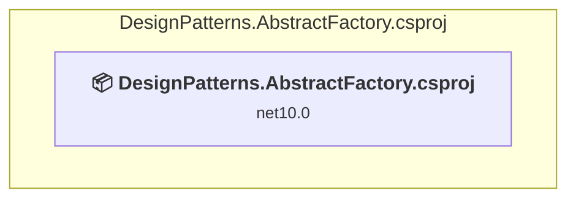

### API Compatibility

| Category | Count | Impact |
| :--- | :---: | :--- |
| 🔴 Binary Incompatible | 0 | High - Require code changes |
| 🟡 Source Incompatible | 0 | Medium - Needs re-compilation and potential conflicting API error fixing |
| 🔵 Behavioral change | 0 | Low - Behavioral changes that may require testing at runtime |
| ✅ Compatible | 0 |  |
| ***Total APIs Analyzed*** | ***0*** |  |

<a id="designpatternsadapterpatterndesignpatternsadapterpatterncsproj"></a>
### DesignPatterns.AdapterPattern\DesignPatterns.AdapterPattern.csproj

#### Project Info

- **Current Target Framework:** netcoreapp3.1
- **Proposed Target Framework:** net10.0
- **SDK-style**: True
- **Project Kind:** DotNetCoreApp
- **Dependencies**: 0
- **Dependants**: 0
- **Number of Files**: 5
- **Number of Files with Incidents**: 2
- **Lines of Code**: 89
- **Estimated LOC to modify**: 1+ (at least 1.1% of the project)

#### Dependency Graph

Legend:
📦 SDK-style project
⚙️ Classic project

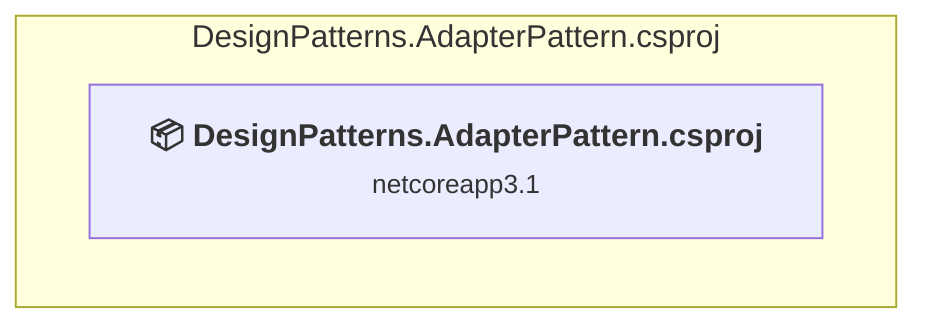

### API Compatibility

| Category | Count | Impact |
| :--- | :---: | :--- |
| 🔴 Binary Incompatible | 0 | High - Require code changes |
| 🟡 Source Incompatible | 0 | Medium - Needs re-compilation and potential conflicting API error fixing |
| 🔵 Behavioral change | 1 | Low - Behavioral changes that may require testing at runtime |
| ✅ Compatible | 58 |  |
| ***Total APIs Analyzed*** | ***59*** |  |

<a id="designpatternsbridgepatterndesignpatternsbridgepatterncsproj"></a>
### DesignPatterns.BridgePattern\DesignPatterns.BridgePattern.csproj

#### Project Info

- **Current Target Framework:** netcoreapp3.1
- **Proposed Target Framework:** net10.0
- **SDK-style**: True
- **Project Kind:** DotNetCoreApp
- **Dependencies**: 0
- **Dependants**: 0
- **Number of Files**: 8
- **Number of Files with Incidents**: 1
- **Lines of Code**: 148
- **Estimated LOC to modify**: 0+ (at least 0.0% of the project)

#### Dependency Graph

Legend:
📦 SDK-style project
⚙️ Classic project

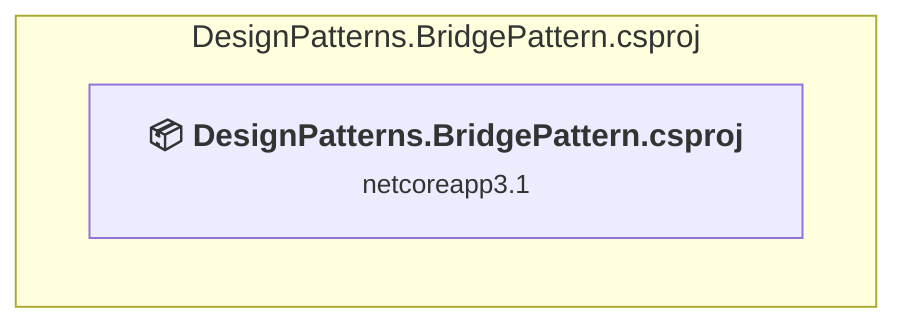

### API Compatibility

| Category | Count | Impact |
| :--- | :---: | :--- |
| 🔴 Binary Incompatible | 0 | High - Require code changes |
| 🟡 Source Incompatible | 0 | Medium - Needs re-compilation and potential conflicting API error fixing |
| 🔵 Behavioral change | 0 | Low - Behavioral changes that may require testing at runtime |
| ✅ Compatible | 68 |  |
| ***Total APIs Analyzed*** | ***68*** |  |

<a id="designpatternsbuilderpatterndesignpatternsbuilderpatterncsproj"></a>
### DesignPatterns.BuilderPattern\DesignPatterns.BuilderPattern.csproj

#### Project Info

- **Current Target Framework:** netcoreapp3.0
- **Proposed Target Framework:** net10.0
- **SDK-style**: True
- **Project Kind:** DotNetCoreApp
- **Dependencies**: 0
- **Dependants**: 0
- **Number of Files**: 5
- **Number of Files with Incidents**: 1
- **Lines of Code**: 113
- **Estimated LOC to modify**: 0+ (at least 0.0% of the project)

#### Dependency Graph

Legend:
📦 SDK-style project
⚙️ Classic project

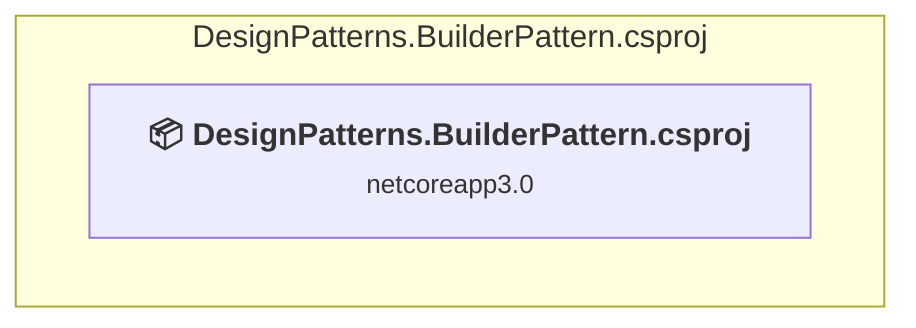

### API Compatibility

| Category | Count | Impact |
| :--- | :---: | :--- |
| 🔴 Binary Incompatible | 0 | High - Require code changes |
| 🟡 Source Incompatible | 0 | Medium - Needs re-compilation and potential conflicting API error fixing |
| 🔵 Behavioral change | 0 | Low - Behavioral changes that may require testing at runtime |
| ✅ Compatible | 0 |  |
| ***Total APIs Analyzed*** | ***0*** |  |

<a id="designpatternschainofresponsibilitypatterndesignpatternschainofresponsibilitypatterncsproj"></a>
### DesignPatterns.ChainOfResponsibilityPattern\DesignPatterns.ChainOfResponsibilityPattern.csproj

#### Project Info

- **Current Target Framework:** netcoreapp3.1
- **Proposed Target Framework:** net10.0
- **SDK-style**: True
- **Project Kind:** DotNetCoreApp
- **Dependencies**: 0
- **Dependants**: 0
- **Number of Files**: 6
- **Number of Files with Incidents**: 1
- **Lines of Code**: 125
- **Estimated LOC to modify**: 0+ (at least 0.0% of the project)

#### Dependency Graph

Legend:
📦 SDK-style project
⚙️ Classic project

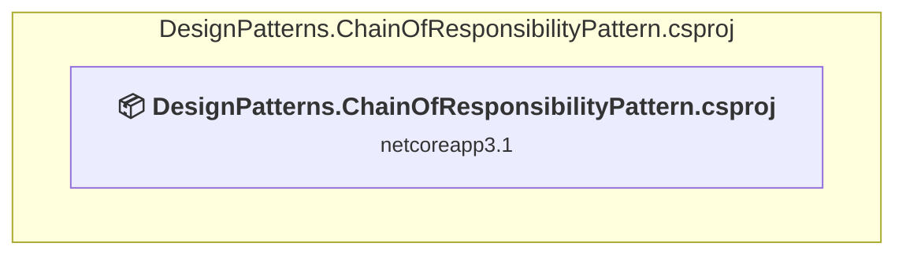

### API Compatibility

| Category | Count | Impact |
| :--- | :---: | :--- |
| 🔴 Binary Incompatible | 0 | High - Require code changes |
| 🟡 Source Incompatible | 0 | Medium - Needs re-compilation and potential conflicting API error fixing |
| 🔵 Behavioral change | 0 | Low - Behavioral changes that may require testing at runtime |
| ✅ Compatible | 53 |  |
| ***Total APIs Analyzed*** | ***53*** |  |

<a id="designpatternscommandpatterndesignpatternscommandpatterncsproj"></a>
### DesignPatterns.CommandPattern\DesignPatterns.CommandPattern.csproj

#### Project Info

- **Current Target Framework:** netcoreapp3.1
- **Proposed Target Framework:** net10.0
- **SDK-style**: True
- **Project Kind:** DotNetCoreApp
- **Dependencies**: 0
- **Dependants**: 0
- **Number of Files**: 8
- **Number of Files with Incidents**: 1
- **Lines of Code**: 207
- **Estimated LOC to modify**: 0+ (at least 0.0% of the project)

#### Dependency Graph

Legend:
📦 SDK-style project
⚙️ Classic project

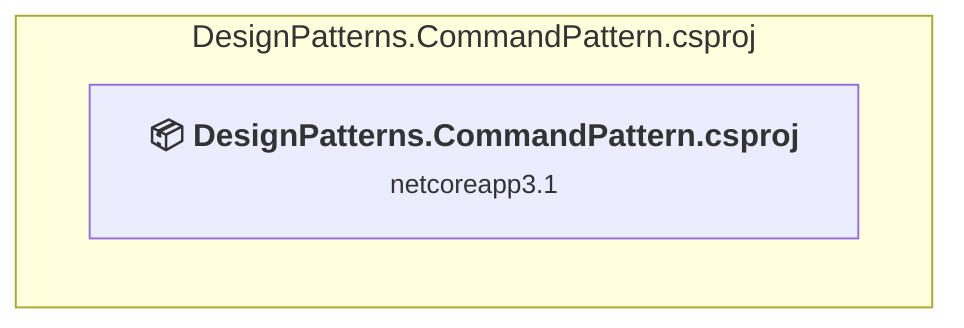

### API Compatibility

| Category | Count | Impact |
| :--- | :---: | :--- |
| 🔴 Binary Incompatible | 0 | High - Require code changes |
| 🟡 Source Incompatible | 0 | Medium - Needs re-compilation and potential conflicting API error fixing |
| 🔵 Behavioral change | 0 | Low - Behavioral changes that may require testing at runtime |
| ✅ Compatible | 173 |  |
| ***Total APIs Analyzed*** | ***173*** |  |

<a id="designpatternscompositepatterndesignpatternscompositepatterncsproj"></a>
### DesignPatterns.CompositePattern\DesignPatterns.CompositePattern.csproj

#### Project Info

- **Current Target Framework:** netcoreapp3.1
- **Proposed Target Framework:** net10.0
- **SDK-style**: True
- **Project Kind:** DotNetCoreApp
- **Dependencies**: 0
- **Dependants**: 0
- **Number of Files**: 5
- **Number of Files with Incidents**: 1
- **Lines of Code**: 144
- **Estimated LOC to modify**: 0+ (at least 0.0% of the project)

#### Dependency Graph

Legend:
📦 SDK-style project
⚙️ Classic project

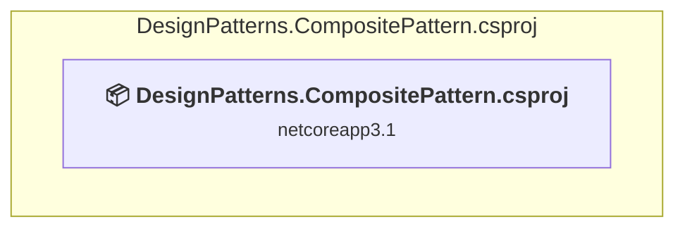

### API Compatibility

| Category | Count | Impact |
| :--- | :---: | :--- |
| 🔴 Binary Incompatible | 0 | High - Require code changes |
| 🟡 Source Incompatible | 0 | Medium - Needs re-compilation and potential conflicting API error fixing |
| 🔵 Behavioral change | 0 | Low - Behavioral changes that may require testing at runtime |
| ✅ Compatible | 163 |  |
| ***Total APIs Analyzed*** | ***163*** |  |

<a id="designpatternsdecoratorpatterndesignpatternsdecoratorpatterncsproj"></a>
### DesignPatterns.DecoratorPattern\DesignPatterns.DecoratorPattern.csproj

#### Project Info

- **Current Target Framework:** netcoreapp3.1
- **Proposed Target Framework:** net10.0
- **SDK-style**: True
- **Project Kind:** DotNetCoreApp
- **Dependencies**: 0
- **Dependants**: 0
- **Number of Files**: 7
- **Number of Files with Incidents**: 1
- **Lines of Code**: 135
- **Estimated LOC to modify**: 0+ (at least 0.0% of the project)

#### Dependency Graph

Legend:
📦 SDK-style project
⚙️ Classic project

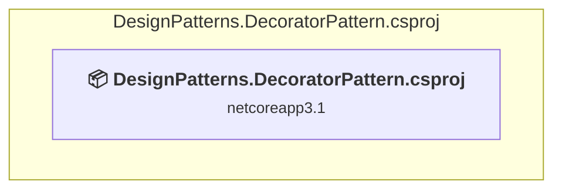

### API Compatibility

| Category | Count | Impact |
| :--- | :---: | :--- |
| 🔴 Binary Incompatible | 0 | High - Require code changes |
| 🟡 Source Incompatible | 0 | Medium - Needs re-compilation and potential conflicting API error fixing |
| 🔵 Behavioral change | 0 | Low - Behavioral changes that may require testing at runtime |
| ✅ Compatible | 74 |  |
| ***Total APIs Analyzed*** | ***74*** |  |

<a id="designpatternsfacadepatterndesignpatternsfacadepatterncsproj"></a>
### DesignPatterns.FacadePattern\DesignPatterns.FacadePattern.csproj

#### Project Info

- **Current Target Framework:** netcoreapp3.1
- **Proposed Target Framework:** net10.0
- **SDK-style**: True
- **Project Kind:** DotNetCoreApp
- **Dependencies**: 0
- **Dependants**: 0
- **Number of Files**: 1
- **Number of Files with Incidents**: 1
- **Lines of Code**: 13
- **Estimated LOC to modify**: 0+ (at least 0.0% of the project)

#### Dependency Graph

Legend:
📦 SDK-style project
⚙️ Classic project

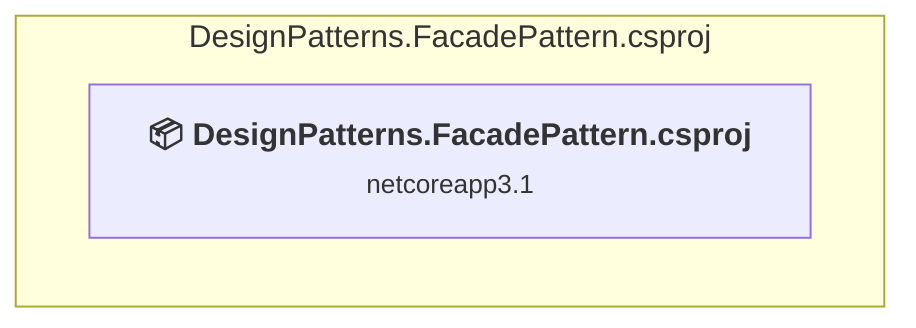

### API Compatibility

| Category | Count | Impact |
| :--- | :---: | :--- |
| 🔴 Binary Incompatible | 0 | High - Require code changes |
| 🟡 Source Incompatible | 0 | Medium - Needs re-compilation and potential conflicting API error fixing |
| 🔵 Behavioral change | 0 | Low - Behavioral changes that may require testing at runtime |
| ✅ Compatible | 7 |  |
| ***Total APIs Analyzed*** | ***7*** |  |

<a id="designpatternsflyweightpatterndesignpatternsflyweightpatterncsproj"></a>
### DesignPatterns.FlyWeightPattern\DesignPatterns.FlyWeightPattern.csproj

#### Project Info

- **Current Target Framework:** netcoreapp3.1
- **Proposed Target Framework:** net10.0
- **SDK-style**: True
- **Project Kind:** DotNetCoreApp
- **Dependencies**: 0
- **Dependants**: 0
- **Number of Files**: 5
- **Number of Files with Incidents**: 1
- **Lines of Code**: 120
- **Estimated LOC to modify**: 0+ (at least 0.0% of the project)

#### Dependency Graph

Legend:
📦 SDK-style project
⚙️ Classic project

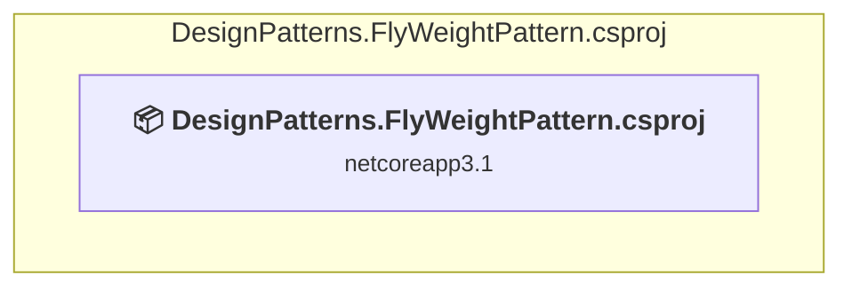

### API Compatibility

| Category | Count | Impact |
| :--- | :---: | :--- |
| 🔴 Binary Incompatible | 0 | High - Require code changes |
| 🟡 Source Incompatible | 0 | Medium - Needs re-compilation and potential conflicting API error fixing |
| 🔵 Behavioral change | 0 | Low - Behavioral changes that may require testing at runtime |
| ✅ Compatible | 78 |  |
| ***Total APIs Analyzed*** | ***78*** |  |

<a id="designpatternsiteratorpatterndesignpatternsiteratorpatterncsproj"></a>
### DesignPatterns.IteratorPattern\DesignPatterns.IteratorPattern.csproj

#### Project Info

- **Current Target Framework:** netcoreapp3.1
- **Proposed Target Framework:** net10.0
- **SDK-style**: True
- **Project Kind:** DotNetCoreApp
- **Dependencies**: 0
- **Dependants**: 0
- **Number of Files**: 7
- **Number of Files with Incidents**: 1
- **Lines of Code**: 146
- **Estimated LOC to modify**: 0+ (at least 0.0% of the project)

#### Dependency Graph

Legend:
📦 SDK-style project
⚙️ Classic project


### API Compatibility

| Category | Count | Impact |
| :--- | :---: | :--- |
| 🔴 Binary Incompatible | 0 | High - Require code changes |
| 🟡 Source Incompatible | 0 | Medium - Needs re-compilation and potential conflicting API error fixing |
| 🔵 Behavioral change | 0 | Low - Behavioral changes that may require testing at runtime |
| ✅ Compatible | 72 |  |
| ***Total APIs Analyzed*** | ***72*** |  |

<a id="designpatternsmediatorpatterndesignpatternsmediatorpatterncsproj"></a>
### DesignPatterns.MediatorPattern\DesignPatterns.MediatorPattern.csproj

#### Project Info

- **Current Target Framework:** netcoreapp3.1
- **Proposed Target Framework:** net10.0
- **SDK-style**: True
- **Project Kind:** DotNetCoreApp
- **Dependencies**: 0
- **Dependants**: 0
- **Number of Files**: 6
- **Number of Files with Incidents**: 1
- **Lines of Code**: 108
- **Estimated LOC to modify**: 0+ (at least 0.0% of the project)

#### Dependency Graph

Legend:
📦 SDK-style project
⚙️ Classic project


### API Compatibility

| Category | Count | Impact |
| :--- | :---: | :--- |
| 🔴 Binary Incompatible | 0 | High - Require code changes |
| 🟡 Source Incompatible | 0 | Medium - Needs re-compilation and potential conflicting API error fixing |
| 🔵 Behavioral change | 0 | Low - Behavioral changes that may require testing at runtime |
| ✅ Compatible | 57 |  |
| ***Total APIs Analyzed*** | ***57*** |  |

<a id="designpatternsmementopatterndesignpatternsmementopatterncsproj"></a>
### DesignPatterns.MementoPattern\DesignPatterns.MementoPattern.csproj

#### Project Info

- **Current Target Framework:** netcoreapp3.0
- **Proposed Target Framework:** net10.0
- **SDK-style**: True
- **Project Kind:** DotNetCoreApp
- **Dependencies**: 0
- **Dependants**: 0
- **Number of Files**: 4
- **Number of Files with Incidents**: 1
- **Lines of Code**: 162
- **Estimated LOC to modify**: 0+ (at least 0.0% of the project)

#### Dependency Graph

Legend:
📦 SDK-style project
⚙️ Classic project

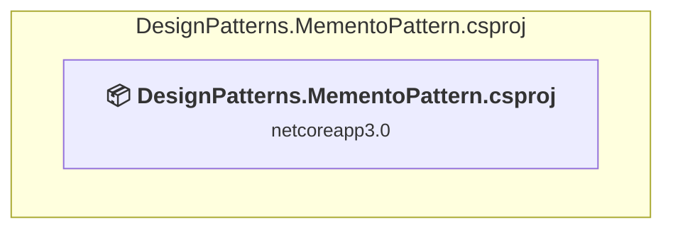

### API Compatibility

| Category | Count | Impact |
| :--- | :---: | :--- |
| 🔴 Binary Incompatible | 0 | High - Require code changes |
| 🟡 Source Incompatible | 0 | Medium - Needs re-compilation and potential conflicting API error fixing |
| 🔵 Behavioral change | 0 | Low - Behavioral changes that may require testing at runtime |
| ✅ Compatible | 0 |  |
| ***Total APIs Analyzed*** | ***0*** |  |

<a id="designpatternsobserverpatterndesignpatternsobserverpatterncsproj"></a>
### DesignPatterns.ObserverPattern\DesignPatterns.ObserverPattern.csproj

#### Project Info

- **Current Target Framework:** netcoreapp3.1
- **Proposed Target Framework:** net10.0
- **SDK-style**: True
- **Project Kind:** DotNetCoreApp
- **Dependencies**: 0
- **Dependants**: 0
- **Number of Files**: 6
- **Number of Files with Incidents**: 1
- **Lines of Code**: 128
- **Estimated LOC to modify**: 0+ (at least 0.0% of the project)

#### Dependency Graph

Legend:
📦 SDK-style project
⚙️ Classic project

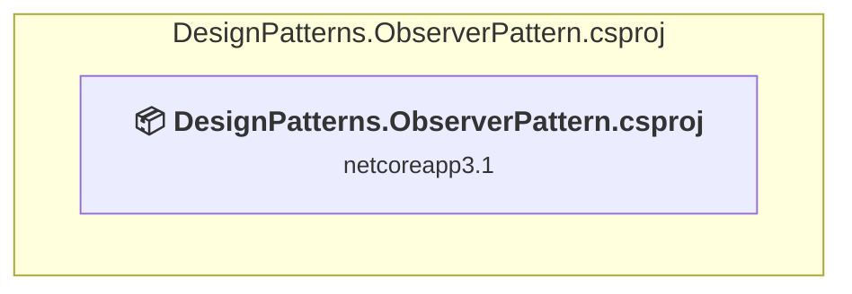

### API Compatibility

| Category | Count | Impact |
| :--- | :---: | :--- |
| 🔴 Binary Incompatible | 0 | High - Require code changes |
| 🟡 Source Incompatible | 0 | Medium - Needs re-compilation and potential conflicting API error fixing |
| 🔵 Behavioral change | 0 | Low - Behavioral changes that may require testing at runtime |
| ✅ Compatible | 82 |  |
| ***Total APIs Analyzed*** | ***82*** |  |

<a id="designpatternsproxypatterndesignpatternsproxypatterncsproj"></a>
### DesignPatterns.ProxyPattern\DesignPatterns.ProxyPattern.csproj

#### Project Info

- **Current Target Framework:** netcoreapp3.1
- **Proposed Target Framework:** net10.0
- **SDK-style**: True
- **Project Kind:** DotNetCoreApp
- **Dependencies**: 0
- **Dependants**: 0
- **Number of Files**: 4
- **Number of Files with Incidents**: 1
- **Lines of Code**: 87
- **Estimated LOC to modify**: 0+ (at least 0.0% of the project)

#### Dependency Graph

Legend:
📦 SDK-style project
⚙️ Classic project

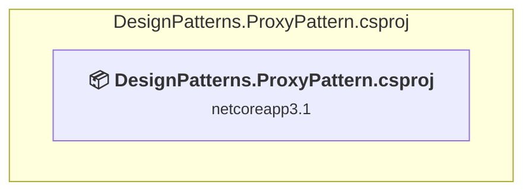

### API Compatibility

| Category | Count | Impact |
| :--- | :---: | :--- |
| 🔴 Binary Incompatible | 0 | High - Require code changes |
| 🟡 Source Incompatible | 0 | Medium - Needs re-compilation and potential conflicting API error fixing |
| 🔵 Behavioral change | 0 | Low - Behavioral changes that may require testing at runtime |
| ✅ Compatible | 62 |  |
| ***Total APIs Analyzed*** | ***62*** |  |

<a id="designpatternssingletondesignpatternssingletoncsproj"></a>
### DesignPatterns.Singleton\DesignPatterns.Singleton.csproj

#### Project Info

- **Current Target Framework:** netcoreapp3.1
- **Proposed Target Framework:** net10.0
- **SDK-style**: True
- **Project Kind:** DotNetCoreApp
- **Dependencies**: 0
- **Dependants**: 0
- **Number of Files**: 2
- **Number of Files with Incidents**: 1
- **Lines of Code**: 47
- **Estimated LOC to modify**: 0+ (at least 0.0% of the project)

#### Dependency Graph

Legend:
📦 SDK-style project
⚙️ Classic project

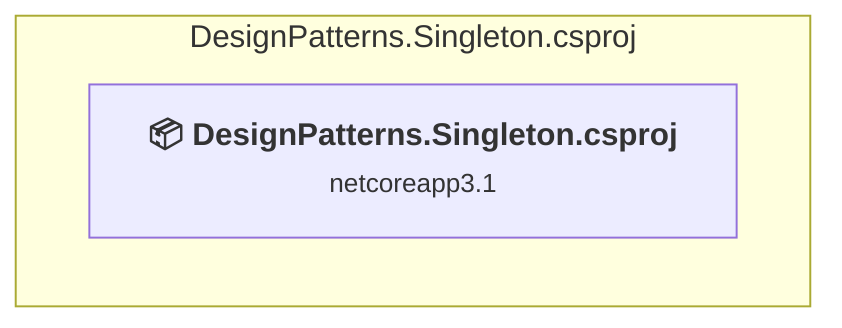

### API Compatibility

| Category | Count | Impact |
| :--- | :---: | :--- |
| 🔴 Binary Incompatible | 0 | High - Require code changes |
| 🟡 Source Incompatible | 0 | Medium - Needs re-compilation and potential conflicting API error fixing |
| 🔵 Behavioral change | 0 | Low - Behavioral changes that may require testing at runtime |
| ✅ Compatible | 26 |  |
| ***Total APIs Analyzed*** | ***26*** |  |

<a id="designpatternsstatepatterndesignpatternsstatepatterncsproj"></a>
### DesignPatterns.StatePattern\DesignPatterns.StatePattern.csproj

#### Project Info

- **Current Target Framework:** netcoreapp3.1
- **Proposed Target Framework:** net10.0
- **SDK-style**: True
- **Project Kind:** DotNetCoreApp
- **Dependencies**: 0
- **Dependants**: 0
- **Number of Files**: 10
- **Number of Files with Incidents**: 1
- **Lines of Code**: 236
- **Estimated LOC to modify**: 0+ (at least 0.0% of the project)

#### Dependency Graph

Legend:
📦 SDK-style project
⚙️ Classic project

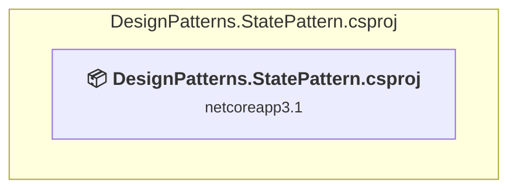

### API Compatibility

| Category | Count | Impact |
| :--- | :---: | :--- |
| 🔴 Binary Incompatible | 0 | High - Require code changes |
| 🟡 Source Incompatible | 0 | Medium - Needs re-compilation and potential conflicting API error fixing |
| 🔵 Behavioral change | 0 | Low - Behavioral changes that may require testing at runtime |
| ✅ Compatible | 165 |  |
| ***Total APIs Analyzed*** | ***165*** |  |

<a id="designpatternsstrategypatterndesignpatternsstrategypatterncsproj"></a>
### DesignPatterns.StrategyPattern\DesignPatterns.StrategyPattern.csproj

#### Project Info

- **Current Target Framework:** netcoreapp3.1
- **Proposed Target Framework:** net10.0
- **SDK-style**: True
- **Project Kind:** DotNetCoreApp
- **Dependencies**: 0
- **Dependants**: 0
- **Number of Files**: 9
- **Number of Files with Incidents**: 1
- **Lines of Code**: 148
- **Estimated LOC to modify**: 0+ (at least 0.0% of the project)

#### Dependency Graph

Legend:
📦 SDK-style project
⚙️ Classic project

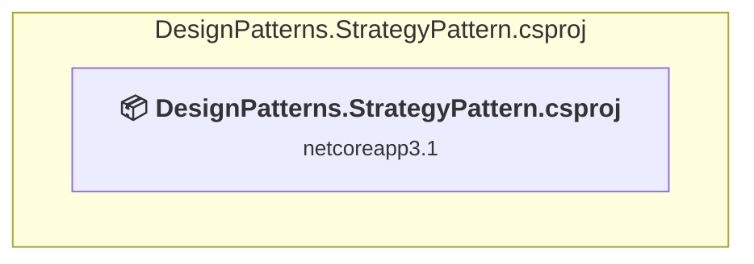

### API Compatibility

| Category | Count | Impact |
| :--- | :---: | :--- |
| 🔴 Binary Incompatible | 0 | High - Require code changes |
| 🟡 Source Incompatible | 0 | Medium - Needs re-compilation and potential conflicting API error fixing |
| 🔵 Behavioral change | 0 | Low - Behavioral changes that may require testing at runtime |
| ✅ Compatible | 57 |  |
| ***Total APIs Analyzed*** | ***57*** |  |

<a id="designpatternstemplatemethodpatterndesignpatternstemplatemethodpatterncsproj"></a>
### DesignPatterns.TemplateMethodPattern\DesignPatterns.TemplateMethodPattern.csproj

#### Project Info

- **Current Target Framework:** netcoreapp3.1
- **Proposed Target Framework:** net10.0
- **SDK-style**: True
- **Project Kind:** DotNetCoreApp
- **Dependencies**: 0
- **Dependants**: 0
- **Number of Files**: 4
- **Number of Files with Incidents**: 1
- **Lines of Code**: 68
- **Estimated LOC to modify**: 0+ (at least 0.0% of the project)

#### Dependency Graph

Legend:
📦 SDK-style project
⚙️ Classic project

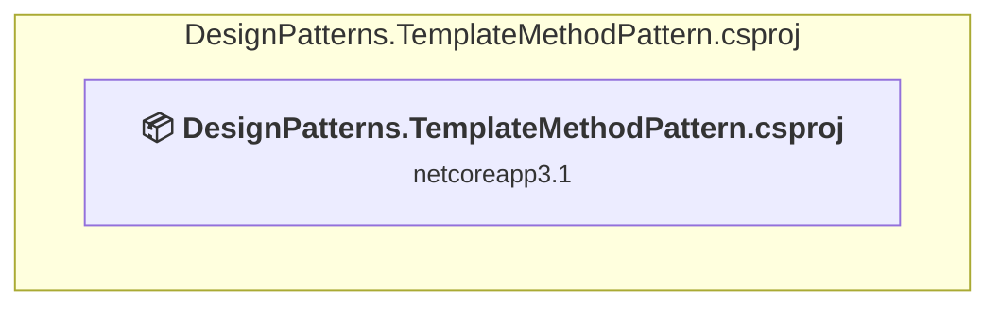

### API Compatibility

| Category | Count | Impact |
| :--- | :---: | :--- |
| 🔴 Binary Incompatible | 0 | High - Require code changes |
| 🟡 Source Incompatible | 0 | Medium - Needs re-compilation and potential conflicting API error fixing |
| 🔵 Behavioral change | 0 | Low - Behavioral changes that may require testing at runtime |
| ✅ Compatible | 33 |  |
| ***Total APIs Analyzed*** | ***33*** |  |

<a id="designpatternsvisitorpatterndesignpatternsvisitorpatterncsproj"></a>
### DesignPatterns.VisitorPattern\DesignPatterns.VisitorPattern.csproj

#### Project Info

- **Current Target Framework:** netcoreapp3.0
- **Proposed Target Framework:** net10.0
- **SDK-style**: True
- **Project Kind:** DotNetCoreApp
- **Dependencies**: 0
- **Dependants**: 0
- **Number of Files**: 7
- **Number of Files with Incidents**: 1
- **Lines of Code**: 119
- **Estimated LOC to modify**: 0+ (at least 0.0% of the project)

#### Dependency Graph

Legend:
📦 SDK-style project
⚙️ Classic project

```mermaid
flowchart TB
    subgraph current["DesignPatterns.VisitorPattern.csproj"]
        MAIN["<b>📦&nbsp;DesignPatterns.VisitorPattern.csproj</b><br/><small>netcoreapp3.0</small>"]
        click MAIN "#designpatternsvisitorpatterndesignpatternsvisitorpatterncsproj"
    end

```

### API Compatibility

| Category | Count | Impact |
| :--- | :---: | :--- |
| 🔴 Binary Incompatible | 0 | High - Require code changes |
| 🟡 Source Incompatible | 0 | Medium - Needs re-compilation and potential conflicting API error fixing |
| 🔵 Behavioral change | 0 | Low - Behavioral changes that may require testing at runtime |
| ✅ Compatible | 0 |  |
| ***Total APIs Analyzed*** | ***0*** |  |

<a id="drylibrarydrylibrarycsproj"></a>
### DRY.Library\DRY.Library.csproj

#### Project Info

- **Current Target Framework:** net472
- **Proposed Target Framework:** net10.0
- **SDK-style**: False
- **Project Kind:** ClassicClassLibrary
- **Dependencies**: 0
- **Dependants**: 2
- **Number of Files**: 2
- **Number of Files with Incidents**: 1
- **Lines of Code**: 56
- **Estimated LOC to modify**: 0+ (at least 0.0% of the project)

#### Dependency Graph

Legend:
📦 SDK-style project
⚙️ Classic project

```mermaid
flowchart TB
    subgraph upstream["Dependants (2)"]
        P7["<b>⚙️&nbsp;DRY.WinForms.csproj</b><br/><small>net472</small>"]
        P8["<b>⚙️&nbsp;DRY.TestProject.csproj</b><br/><small>net472</small>"]
        click P7 "#drywinformsdrywinformscsproj"
        click P8 "#drytestprojectdrytestprojectcsproj"
    end
    subgraph current["DRY.Library.csproj"]
        MAIN["<b>⚙️&nbsp;DRY.Library.csproj</b><br/><small>net472</small>"]
        click MAIN "#drylibrarydrylibrarycsproj"
    end
    P7 --> MAIN
    P8 --> MAIN

```

### API Compatibility

| Category | Count | Impact |
| :--- | :---: | :--- |
| 🔴 Binary Incompatible | 0 | High - Require code changes |
| 🟡 Source Incompatible | 0 | Medium - Needs re-compilation and potential conflicting API error fixing |
| 🔵 Behavioral change | 0 | Low - Behavioral changes that may require testing at runtime |
| ✅ Compatible | 11 |  |
| ***Total APIs Analyzed*** | ***11*** |  |

<a id="drytestprojectdrytestprojectcsproj"></a>
### DRY.TestProject\DRY.TestProject.csproj

#### Project Info

- **Current Target Framework:** net472
- **Proposed Target Framework:** net10.0
- **SDK-style**: False
- **Project Kind:** ClassicClassLibrary
- **Dependencies**: 1
- **Dependants**: 0
- **Number of Files**: 2
- **Number of Files with Incidents**: 1
- **Lines of Code**: 61
- **Estimated LOC to modify**: 0+ (at least 0.0% of the project)

#### Dependency Graph

Legend:
📦 SDK-style project
⚙️ Classic project

```mermaid
flowchart TB
    subgraph current["DRY.TestProject.csproj"]
        MAIN["<b>⚙️&nbsp;DRY.TestProject.csproj</b><br/><small>net472</small>"]
        click MAIN "#drytestprojectdrytestprojectcsproj"
    end
    subgraph downstream["Dependencies (1"]
        P6["<b>⚙️&nbsp;DRY.Library.csproj</b><br/><small>net472</small>"]
        click P6 "#drylibrarydrylibrarycsproj"
    end
    MAIN --> P6

```

### API Compatibility

| Category | Count | Impact |
| :--- | :---: | :--- |
| 🔴 Binary Incompatible | 0 | High - Require code changes |
| 🟡 Source Incompatible | 0 | Medium - Needs re-compilation and potential conflicting API error fixing |
| 🔵 Behavioral change | 0 | Low - Behavioral changes that may require testing at runtime |
| ✅ Compatible | 0 |  |
| ***Total APIs Analyzed*** | ***0*** |  |

#### Binding Redirect Configuration

| Rule | Severity | Details | Recommendation |
| :--- | :---: | :--- | :--- |
| Library-hosted entry point missing GenerateBindingRedirectsOutputType | 🟡Potential | OutputType=Library with test framework references, GenerateBindingRedirectsOutputType not set | Add <GenerateBindingRedirectsOutputType>true</GenerateBindingRedirectsOutputType> so MSBuild generates redirects for library-hosted entry points. |

<a id="drywinformsdrywinformscsproj"></a>
### DRY.WinForms\DRY.WinForms.csproj

#### Project Info

- **Current Target Framework:** net472
- **Proposed Target Framework:** net10.0-windows
- **SDK-style**: False
- **Project Kind:** ClassicWinForms
- **Dependencies**: 1
- **Dependants**: 0
- **Number of Files**: 8
- **Number of Files with Incidents**: 5
- **Lines of Code**: 317
- **Estimated LOC to modify**: 176+ (at least 55.5% of the project)

#### Dependency Graph

Legend:
📦 SDK-style project
⚙️ Classic project

```mermaid
flowchart TB
    subgraph current["DRY.WinForms.csproj"]
        MAIN["<b>⚙️&nbsp;DRY.WinForms.csproj</b><br/><small>net472</small>"]
        click MAIN "#drywinformsdrywinformscsproj"
    end
    subgraph downstream["Dependencies (1"]
        P6["<b>⚙️&nbsp;DRY.Library.csproj</b><br/><small>net472</small>"]
        click P6 "#drylibrarydrylibrarycsproj"
    end
    MAIN --> P6

```

### API Compatibility

| Category | Count | Impact |
| :--- | :---: | :--- |
| 🔴 Binary Incompatible | 165 | High - Require code changes |
| 🟡 Source Incompatible | 11 | Medium - Needs re-compilation and potential conflicting API error fixing |
| 🔵 Behavioral change | 0 | Low - Behavioral changes that may require testing at runtime |
| ✅ Compatible | 136 |  |
| ***Total APIs Analyzed*** | ***312*** |  |

#### Project Technologies and Features

| Technology | Issues | Percentage | Migration Path |
| :--- | :---: | :---: | :--- |
| Legacy Configuration System | 2 | 1.1% | Legacy XML-based configuration system (app.config/web.config) that has been replaced by a more flexible configuration model in .NET Core. The old system was rigid and XML-based. Migrate to Microsoft.Extensions.Configuration with JSON/environment variables; use System.Configuration.ConfigurationManager NuGet package as interim bridge if needed. |
| GDI+ / System.Drawing | 9 | 5.1% | System.Drawing APIs for 2D graphics, imaging, and printing that are available via NuGet package System.Drawing.Common. Note: Not recommended for server scenarios due to Windows dependencies; consider cross-platform alternatives like SkiaSharp or ImageSharp for new code. |
| Windows Forms | 165 | 93.8% | Windows Forms APIs for building Windows desktop applications with traditional Forms-based UI that are available in .NET on Windows. Enable Windows Desktop support: Option 1 (Recommended): Target net9.0-windows; Option 2: Add <UseWindowsDesktop>true</UseWindowsDesktop>; Option 3 (Legacy): Use Microsoft.NET.Sdk.WindowsDesktop SDK. |

<a id="factorymethoddesignpatternsfactorymethodcsproj"></a>
### FactoryMethod\DesignPatterns.FactoryMethod.csproj

#### Project Info

- **Current Target Framework:** netcoreapp3.1
- **Proposed Target Framework:** net10.0
- **SDK-style**: True
- **Project Kind:** DotNetCoreApp
- **Dependencies**: 0
- **Dependants**: 0
- **Number of Files**: 7
- **Number of Files with Incidents**: 1
- **Lines of Code**: 103
- **Estimated LOC to modify**: 0+ (at least 0.0% of the project)

#### Dependency Graph

Legend:
📦 SDK-style project
⚙️ Classic project

```mermaid
flowchart TB
    subgraph current["DesignPatterns.FactoryMethod.csproj"]
        MAIN["<b>📦&nbsp;DesignPatterns.FactoryMethod.csproj</b><br/><small>netcoreapp3.1</small>"]
        click MAIN "#factorymethoddesignpatternsfactorymethodcsproj"
    end

```

### API Compatibility

| Category | Count | Impact |
| :--- | :---: | :--- |
| 🔴 Binary Incompatible | 0 | High - Require code changes |
| 🟡 Source Incompatible | 0 | Medium - Needs re-compilation and potential conflicting API error fixing |
| 🔵 Behavioral change | 0 | Low - Behavioral changes that may require testing at runtime |
| ✅ Compatible | 19 |  |
| ***Total APIs Analyzed*** | ***19*** |  |

<a id="soliddependencyinversionsoliddependencyinversioncsproj"></a>
### SOLID.DependencyInversion\SOLID.DependencyInversion.csproj

#### Project Info

- **Current Target Framework:** netcoreapp3.1
- **Proposed Target Framework:** net10.0
- **SDK-style**: True
- **Project Kind:** DotNetCoreApp
- **Dependencies**: 0
- **Dependants**: 0
- **Number of Files**: 10
- **Number of Files with Incidents**: 1
- **Lines of Code**: 167
- **Estimated LOC to modify**: 0+ (at least 0.0% of the project)

#### Dependency Graph

Legend:
📦 SDK-style project
⚙️ Classic project

```mermaid
flowchart TB
    subgraph current["SOLID.DependencyInversion.csproj"]
        MAIN["<b>📦&nbsp;SOLID.DependencyInversion.csproj</b><br/><small>netcoreapp3.1</small>"]
        click MAIN "#soliddependencyinversionsoliddependencyinversioncsproj"
    end

```

### API Compatibility

| Category | Count | Impact |
| :--- | :---: | :--- |
| 🔴 Binary Incompatible | 0 | High - Require code changes |
| 🟡 Source Incompatible | 0 | Medium - Needs re-compilation and potential conflicting API error fixing |
| 🔵 Behavioral change | 0 | Low - Behavioral changes that may require testing at runtime |
| ✅ Compatible | 101 |  |
| ***Total APIs Analyzed*** | ***101*** |  |

<a id="solidinterfacesegregationsolidinterfacesegregationcsproj"></a>
### SOLID.InterfaceSegregation\SOLID.InterfaceSegregation.csproj

#### Project Info

- **Current Target Framework:** netcoreapp3.1
- **Proposed Target Framework:** net10.0
- **SDK-style**: True
- **Project Kind:** DotNetCoreApp
- **Dependencies**: 0
- **Dependants**: 0
- **Number of Files**: 13
- **Number of Files with Incidents**: 1
- **Lines of Code**: 232
- **Estimated LOC to modify**: 0+ (at least 0.0% of the project)

#### Dependency Graph

Legend:
📦 SDK-style project
⚙️ Classic project

```mermaid
flowchart TB
    subgraph current["SOLID.InterfaceSegregation.csproj"]
        MAIN["<b>📦&nbsp;SOLID.InterfaceSegregation.csproj</b><br/><small>netcoreapp3.1</small>"]
        click MAIN "#solidinterfacesegregationsolidinterfacesegregationcsproj"
    end

```

### API Compatibility

| Category | Count | Impact |
| :--- | :---: | :--- |
| 🔴 Binary Incompatible | 0 | High - Require code changes |
| 🟡 Source Incompatible | 0 | Medium - Needs re-compilation and potential conflicting API error fixing |
| 🔵 Behavioral change | 0 | Low - Behavioral changes that may require testing at runtime |
| ✅ Compatible | 198 |  |
| ***Total APIs Analyzed*** | ***198*** |  |

<a id="solidprincipleliskovsubstitutionsolidprincipleliskovsubstitutioncsproj"></a>
### SOLIDPrinciple.LiskovSubstitution\SOLIDPrinciple.LiskovSubstitution.csproj

#### Project Info

- **Current Target Framework:** netcoreapp3.1
- **Proposed Target Framework:** net10.0
- **SDK-style**: True
- **Project Kind:** DotNetCoreApp
- **Dependencies**: 0
- **Dependants**: 0
- **Number of Files**: 8
- **Number of Files with Incidents**: 1
- **Lines of Code**: 141
- **Estimated LOC to modify**: 0+ (at least 0.0% of the project)

#### Dependency Graph

Legend:
📦 SDK-style project
⚙️ Classic project

```mermaid
flowchart TB
    subgraph current["SOLIDPrinciple.LiskovSubstitution.csproj"]
        MAIN["<b>📦&nbsp;SOLIDPrinciple.LiskovSubstitution.csproj</b><br/><small>netcoreapp3.1</small>"]
        click MAIN "#solidprincipleliskovsubstitutionsolidprincipleliskovsubstitutioncsproj"
    end

```

### API Compatibility

| Category | Count | Impact |
| :--- | :---: | :--- |
| 🔴 Binary Incompatible | 0 | High - Require code changes |
| 🟡 Source Incompatible | 0 | Medium - Needs re-compilation and potential conflicting API error fixing |
| 🔵 Behavioral change | 0 | Low - Behavioral changes that may require testing at runtime |
| ✅ Compatible | 67 |  |
| ***Total APIs Analyzed*** | ***67*** |  |

<a id="solidprincipleopenclosesolidprincipleopenclosecsproj"></a>
### SOLIDPrinciple.OpenClose\SOLIDPrinciple.OpenClose.csproj

#### Project Info

- **Current Target Framework:** netcoreapp3.1
- **Proposed Target Framework:** net10.0
- **SDK-style**: True
- **Project Kind:** DotNetCoreApp
- **Dependencies**: 0
- **Dependants**: 0
- **Number of Files**: 10
- **Number of Files with Incidents**: 1
- **Lines of Code**: 172
- **Estimated LOC to modify**: 0+ (at least 0.0% of the project)

#### Dependency Graph

Legend:
📦 SDK-style project
⚙️ Classic project

```mermaid
flowchart TB
    subgraph current["SOLIDPrinciple.OpenClose.csproj"]
        MAIN["<b>📦&nbsp;SOLIDPrinciple.OpenClose.csproj</b><br/><small>netcoreapp3.1</small>"]
        click MAIN "#solidprincipleopenclosesolidprincipleopenclosecsproj"
    end

```

### API Compatibility

| Category | Count | Impact |
| :--- | :---: | :--- |
| 🔴 Binary Incompatible | 0 | High - Require code changes |
| 🟡 Source Incompatible | 0 | Medium - Needs re-compilation and potential conflicting API error fixing |
| 🔵 Behavioral change | 0 | Low - Behavioral changes that may require testing at runtime |
| ✅ Compatible | 104 |  |
| ***Total APIs Analyzed*** | ***104*** |  |

<a id="solidprinciplesingleresponsibilitysolidprinciplesingleresponsibilitycsproj"></a>
### SOLIDPrinciple.SingleResponsibility\SOLIDPrinciple.SingleResponsibility.csproj

#### Project Info

- **Current Target Framework:** netcoreapp3.1
- **Proposed Target Framework:** net10.0
- **SDK-style**: True
- **Project Kind:** DotNetCoreApp
- **Dependencies**: 0
- **Dependants**: 0
- **Number of Files**: 6
- **Number of Files with Incidents**: 1
- **Lines of Code**: 121
- **Estimated LOC to modify**: 0+ (at least 0.0% of the project)

#### Dependency Graph

Legend:
📦 SDK-style project
⚙️ Classic project

```mermaid
flowchart TB
    subgraph current["SOLIDPrinciple.SingleResponsibility.csproj"]
        MAIN["<b>📦&nbsp;SOLIDPrinciple.SingleResponsibility.csproj</b><br/><small>netcoreapp3.1</small>"]
        click MAIN "#solidprinciplesingleresponsibilitysolidprinciplesingleresponsibilitycsproj"
    end

```

### API Compatibility

| Category | Count | Impact |
| :--- | :---: | :--- |
| 🔴 Binary Incompatible | 0 | High - Require code changes |
| 🟡 Source Incompatible | 0 | Medium - Needs re-compilation and potential conflicting API error fixing |
| 🔵 Behavioral change | 0 | Low - Behavioral changes that may require testing at runtime |
| ✅ Compatible | 61 |  |
| ***Total APIs Analyzed*** | ***61*** |  |

